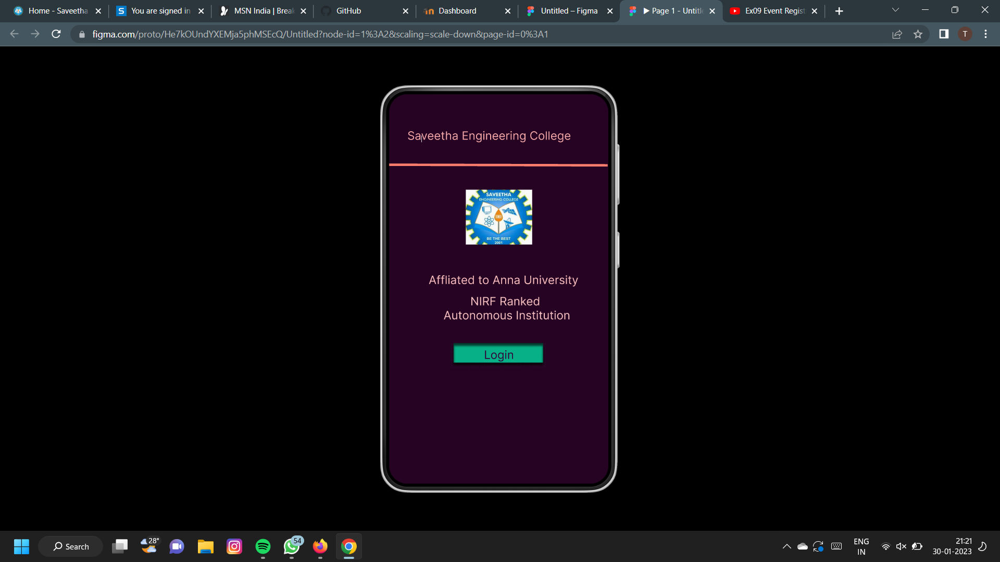
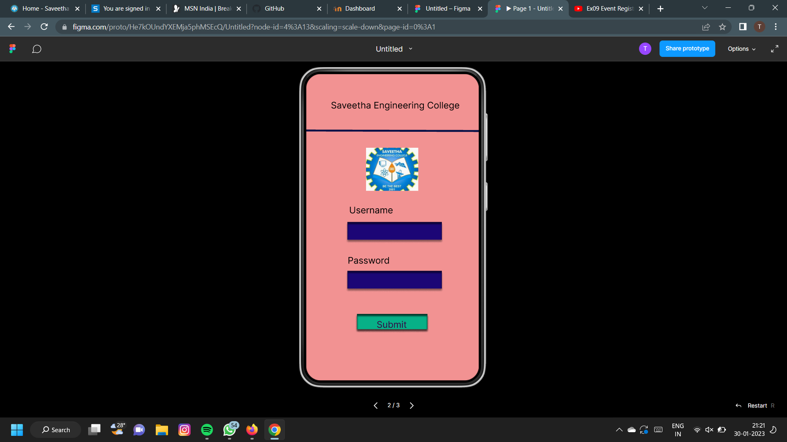
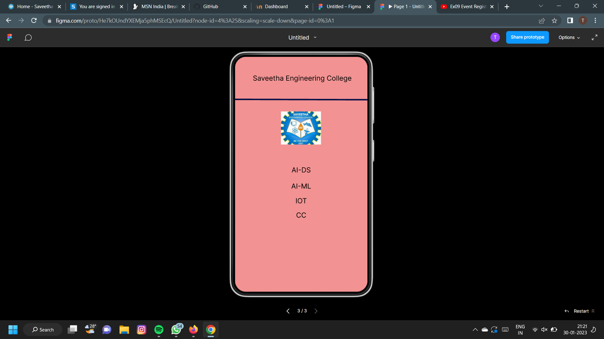

# Event Registration Web Application

## AIM:
To design, develop and deploy a web application for event registration.

## DESIGN STEPS:

### Step 1:
Create a new frame.

### Step 2:
Select any one preset size of your choice.

### Step 3:
Select the shapes you need.

### Step 4:
Import images as needed.

### Step 5:
Create pages based on your need and link them.

### Step 6:

Validate the HTML and CSS code.

### Step 6:

Publish the website in the given URL.

## DESIGN TOOL:
Figma

## Code:
```
/* Home Page */

position: relative;
width: 360px;
height: 640px;
background: #260323;

/* Login Page */

position: relative;
width: 360px;
height: 640px;
background: #F29292;

/* Sec Page */

position: relative;
width: 360px;
height: 640px;
background: #F29292;

/* Login */

position: absolute;
width: 109px;
height: 15px;
left: 126px;
top: 417px;
font-family: 'Inter';
font-style: normal;
font-weight: 400;
font-size: 19px;
line-height: 23px;
text-align: center;
color: #32043A;

/* Rectangle 2 */

position: absolute;
width: 147px;
height: 32px;
left: 106px;
top: 409px;
background: #07B087;
box-shadow: 0px 4px 4px rgba(0, 0, 0, 0.25), 0px 4px 4px rgba(0, 0, 0, 0.25), 0px 4px 4px rgba(0, 0, 0, 0.25), 0px 4px 4px rgba(0, 0, 0, 0.25), inset 0px 4px 4px rgba(0, 0, 0, 0.25), inset 0px 4px 4px rgba(0, 0, 0, 0.25), inset 0px 4px 4px rgba(0, 0, 0, 0.25), inset 0px 4px 4px rgba(0, 0, 0, 0.25);

/* NIRF Ranked Autonomous Institution */

position: absolute;
width: 247px;
height: 42px;
left: 70px;
top: 329px;
font-family: 'Inter';
font-style: normal;
font-weight: 400;
font-size: 19px;
line-height: 23px;
text-align: center;
color: #F7C1C1;

/* sec logo 1 */

position: absolute;
width: 109px;
height: 90px;
left: 126px;
top: 157px;
background: url(sec logo.jpg);

Width
360px
Top
118px
Left
-1px
#F87D6C
4px
All sides
#F87D6C
Center alignment

/* Line 1 */

position: absolute;
width: 360px;
height: 0px;
left: -1px;
top: 118px;
border: 4px solid #F87D6C;
transform: rotate(0.16deg);

Width
270px
Height
42px
Top
294px
Left
53px
Affliated to Anna University
Font
Inter
Weight
400
Size
19px
Line height
22.99px
Align
Center
#FABEBE
/* Affliated to Anna University */

position: absolute;
width: 270px;
height: 42px;
left: 53px;
top: 294px;
font-family: 'Inter';
font-style: normal;
font-weight: 400;
font-size: 19px;
line-height: 23px;
text-align: center;
color: #FABEBE;

Width
529px
Height
23px
Top
57px
Left
-205px
Sa Saveetha Engineering College
Font
Inter
Weight
400
Size
19px
Line height
22.99px
Align
Center
#F4A8A8

/* Sa Saveetha Engineering College */

position: absolute;
width: 529px;
height: 23px;
left: -205px;
top: 57px;
font-family: 'Inter';
font-style: normal;
font-weight: 400;
font-size: 19px;
line-height: 23px;

/* identical to box height */

text-align: center;
color: #F4A8A8;

Width
149px
Height
23px
Top
512px
Left
104px
Submit
Font
Inter
Weight
400
Size
19px
Line height
22.99px
Align
Center
#390342
/* Submit */

position: absolute;
width: 149px;
height: 23px;
left: 104px;
top: 512px;
font-family: 'Inter';
font-style: normal;
font-weight: 400;
font-size: 19px;
line-height: 23px;

/* identical to box height */

text-align: center;
color: #390342;

/* Password */

position: absolute;
width: 99px;
height: 19px;
left: 81px;
top: 378px;
font-family: 'Inter';
font-style: normal;
font-weight: 400;
font-size: 19px;
line-height: 23px;
text-align: center;
color: #000000;

/* Username */

position: absolute;
width: 99px;
height: 19px;
left: 86px;
top: 273px;
font-family: 'Inter';
font-style: normal;
font-weight: 400;
font-size: 19px;
line-height: 23px;
text-align: center;
color: #000000;

/* Login Page */

position: relative;
width: 360px;
height: 640px;
background: #F29292;

/* Sec Page */

position: relative;
width: 360px;
height: 640px;
background: #F29292;

/* CC */

position: absolute;
width: 80px;
height: 31px;
left: 140px;
top: 420px;
font-family: 'Inter';
font-style: normal;
font-weight: 400;
font-size: 19px;
line-height: 23px;
text-align: center;
color: #000000;

/* IOT */

position: absolute;
width: 80px;
height: 31px;
left: 140px;
top: 381px;
font-family: 'Inter';
font-style: normal;
font-weight: 400;
font-size: 19px;
line-height: 23px;
text-align: center;
color: #000000;

/* AI-ML */

position: absolute;
width: 80px;
height: 46px;
left: 140px;
top: 318px;
font-family: 'Inter';
font-style: normal;
font-weight: 400;
font-size: 19px;
line-height: 23px;
text-align: center;
color: #000000;

position: absolute;
width: 80px;
height: 46px;
left: 140px;
top: 274px;
font-family: 'Inter';
font-style: normal;
font-weight: 400;
font-size: 19px;
line-height: 23px;
text-align: center;
color: #000000;

```

## OUTPUT:





## RESULT:
The program to design, develop and deploy a web application for event registration is completed successfully.